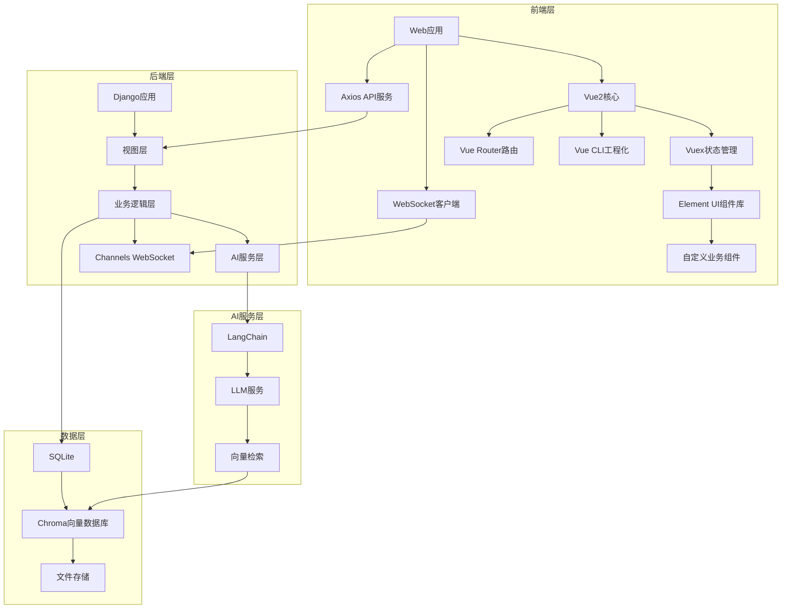
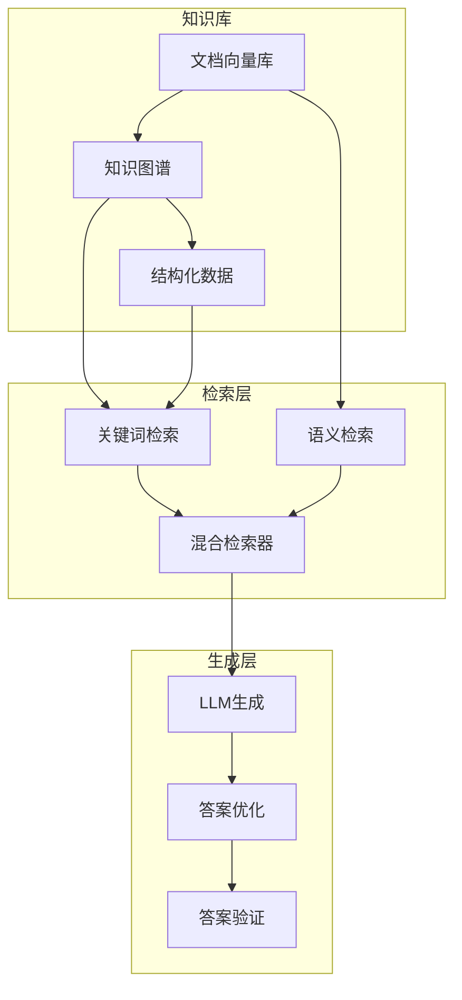

<h1 align = "center">系统设计</h1>  

## 1. 系统架构设计

### 1.1 整体架构


### 1.2 技术栈选型
1. 前端技术
   - 核心框架
      - Vue 2.7（Options API）
      - Vue Router 3.6
      - Vuex 3.6（状态管理）
   - UI框架
      - Element UI 2.15（基础组件库）
      - SCSS 1.32（样式预处理器）
      - Vue-Awesome 4.0（图标库）
   - 网络通信
      - Axios 0.21（REST API调用）
      - WebSocket（实时通信）
      - JWT认证（Token管理）
   - 工程化工具
      - Vue CLI 5.0（项目脚手架）
      - Webpack 5.0（构建工具）
      - Babel 7.0（ES6转译）
   
2. 后端技术
   - Django 4.2
   - Django REST framework（核心API）
   - Django Channels（WebSocket支持）
3. 数据存储
   - SQLite（开发阶段）
   - Chroma 向量数据库
   - 文件存储系统
4. AI技术
   - LangChain 框架
   - OpenAI/Gemini API
   - Sentence Transformers

## 2. 核心模块设计

### 2.1 文档处理模块
- 文档预处理
  - 格式转换
  - 文本清理
  - 元数据提取
- 文档管理
  - 版本控制
  - 访问权限
  - 存储管理

### 2.2 RAG引擎模块
- 对话管理
  - 多轮对话上下文
  - 会话状态管理
  - 用户意图识别
- 答案生成
  - 质量评估
  - 相关文档推荐
  - 用户反馈处理

### 2.3 测验生成模块
- 题目生成
  - 难度级别控制
  - 知识点标签
  - 题型管理
- 学习跟踪
  - 错题分析
  - 进度跟踪
  - 知识点掌握度

### 2.4 对话管理模块
- 会话控制
  - 状态管理
  - 历史记录
  - 上下文维护
- 交互支持
  - 多模态交互
  - 实时响应
  - 历史导出

## 3. 数据模型设计

### 3.1 数据库模型
```python
# 核心模型
class Document(models.Model):
    title = models.CharField(max_length=200)
    content = models.TextField()
    file_path = models.CharField(max_length=500)
    metadata = models.JSONField()
    version = models.IntegerField(default=1)
    created_at = models.DateTimeField(auto_now_add=True)
    updated_at = models.DateTimeField(auto_now=True)

class Question(models.Model):
    QUESTION_TYPES = [
        ('MC', 'Multiple Choice'),
        ('TF', 'True/False'),
        ('FB', 'Fill in Blank'),
        ('SA', 'Short Answer')
    ]
    
    content = models.TextField()
    type = models.CharField(max_length=2, choices=QUESTION_TYPES)
    difficulty = models.IntegerField()
    knowledge_points = models.JSONField()
    options = models.JSONField(null=True)
    answer = models.TextField()
    explanation = models.TextField()
    document = models.ForeignKey(Document, on_delete=models.CASCADE)

class Conversation(models.Model):
    user = models.ForeignKey(User, on_delete=models.CASCADE)
    mode = models.CharField(max_length=20)
    context = models.JSONField()
    created_at = models.DateTimeField(auto_now_add=True)
    
class Message(models.Model):
    conversation = models.ForeignKey(Conversation, on_delete=models.CASCADE)
    content = models.TextField()
    is_user = models.BooleanField()
    feedback = models.IntegerField(null=True)
    created_at = models.DateTimeField(auto_now_add=True)
```

## 4. API设计

### 4.1 RESTful API
1. 文档管理
   - POST /api/documents/upload
     - 文件类型验证
     - 大小限制
     - 元数据提取
   - GET /api/documents/
     - 分页
     - 过滤
     - 排序
   - DELETE /api/documents/{id}
   - PUT /api/documents/{id}
   - GET /api/documents/{id}/metadata

2. 对话接口
   - POST /api/chat/
     - 上下文参数
     - 模式选择
   - GET /api/chat/history
     - 时间范围
     - 分页
   - DELETE /api/chat/{id}
   - POST /api/chat/feedback

3. 测验接口
   - POST /api/quiz/generate
     - 难度参数
     - 题型选择
   - POST /api/quiz/submit
     - 答题时间
     - 正确性
   - GET /api/quiz/history
   - GET /api/quiz/analysis

4. 用户接口
   - POST /api/users/register
   - POST /api/users/login
   - GET /api/users/profile
   - PUT /api/users/settings

### 4.2 WebSocket API
- ws://host/ws/chat/
  - 心跳检测
  - 重连机制
- ws://host/ws/quiz/
  - 实时测验
  - 进度同步
- ws://host/ws/notification/
  - 系统通知
  - 状态更新

## 5. 安全设计（后续开发）

### 5.1 接口安全
- 请求频率限制
- 参数验证
- 错误处理
- 日志记录

### 5.2 数据安全
- 文档访问控制
- 数据加密存储
- 敏感信息脱敏
- 操作审计日志

## 6. 性能优化（后续开发）

### 6.1 缓存策略
- 文档缓存
- 向量检索缓存
- 会话状态缓存
- 静态资源缓存

### 6.2 并发处理
- 异步任务处理
- 批量文档处理
- 并发请求控制
- 资源池管理

## 7. 部署架构（后续开发）

### 7.1 开发环境
```
+------------------+
|   开发环境配置   |
+------------------+
| Python 3.9+      |
| SQLite           |
| ChromaDB         |
+------------------+
```

### 7.2 生产环境
```
+------------------+     +------------------+
|   负载均衡器     |     |   应用服务器    |
|    Nginx         | --> |    Gunicorn     |
+------------------+     +------------------+
        |                       |
        v                       v
+------------------+     +------------------+
|   数据库服务器   |     |   文件存储      |
|   PostgreSQL     |     |   文件系统      |
+------------------+     +------------------+
```

## 8. 混合RAG实现设计

### 8.1 混合RAG架构


### 8.2 核心组件

#### 8.2.1 混合检索器
- 关键词检索
  - 基于TF-IDF的文本匹配
  - 基于知识图谱的实体检索
  - 基于结构化数据的精确匹配

- 语义检索
  - 基于向量相似度的语义匹配
  - 基于文档结构的上下文检索
  - 基于知识图谱的语义扩展

#### 8.2.2 知识库构建
- 文档向量化
  - 文本分块策略
  - 向量编码方法
  - 元数据提取

- 知识图谱
  - 实体识别
  - 关系抽取
  - 图谱构建

- 结构化数据
  - 表格数据提取
  - 列表数据提取
  - 数据规范化

#### 8.2.3 答案生成
- 提示词工程
  - 上下文组装
  - 指令设计
  - 约束条件

- 答案优化
  - 答案格式化
  - 引用溯源
  - 置信度评估

### 8.3 实现流程

1. 文档处理阶段
   ```
   原始文档 -> 文本提取 -> 分块处理 -> 向量化 -> 知识提取 -> 知识库构建
   ```

2. 检索阶段
   ```
   用户问题 -> 问题分析 -> 混合检索 -> 相关文档 -> 知识融合
   ```

3. 生成阶段
   ```
   知识融合 -> 提示词构建 -> LLM生成 -> 答案优化 -> 结果输出
   ```

### 8.4 关键算法

#### 8.4.1 混合检索算法
```python
class HybridRetriever:
    def __init__(self):
        self.keyword_retriever = KeywordRetriever()
        self.semantic_retriever = SemanticRetriever()
        self.knowledge_retriever = KnowledgeRetriever()
    
    def retrieve(self, query):
        # 1. 并行检索
        keyword_results = self.keyword_retriever.search(query)
        semantic_results = self.semantic_retriever.search(query)
        knowledge_results = self.knowledge_retriever.search(query)
        
        # 2. 结果融合
        merged_results = self.merge_results(
            keyword_results,
            semantic_results,
            knowledge_results
        )
        
        # 3. 重排序
        reranked_results = self.rerank(merged_results)
        
        return reranked_results
```

#### 8.4.2 知识融合算法
```python
class KnowledgeFusion:
    def __init__(self):
        self.vector_store = Chroma()
        self.knowledge_graph = KnowledgeGraph()
    
    def fuse(self, retrieved_docs):
        # 1. 文档对齐
        aligned_docs = self.align_documents(retrieved_docs)
        
        # 2. 知识补充
        enriched_docs = self.enrich_knowledge(aligned_docs)
        
        # 3. 冲突解决
        resolved_docs = self.resolve_conflicts(enriched_docs)
        
        return resolved_docs
```

### 8.5 优化策略

#### 8.5.1 检索优化
- 动态权重调整
- 上下文感知检索
- 多粒度检索

#### 8.5.2 生成优化
- 答案模板化
- 多轮对话优化
- 答案质量评估

#### 8.5.3 性能优化
- 缓存机制
- 并行处理
- 增量更新

### 8.6 评估指标

#### 8.6.1 检索评估
- 召回率
- 准确率
- 响应时间

#### 8.6.2 生成评估
- 答案相关性
- 答案完整性
- 答案准确性

#### 8.6.3 系统评估
- 用户满意度
- 系统响应时间
- 资源利用率

## 9. 风险评估与规避策略 (Risk Assessment & Mitigation)

本章节旨在识别项目在技术、管理及产品层面可能面临的潜在风险，并提出相应的规避与缓解策略，以保障项目顺利推进和高质量交付。

### 9.1 技术风险

| 风险点 (Risk) | 风险描述 (Description) | 可能性 | 影响程度 | 规避与缓解策略 (Mitigation Strategy) |
| :--- | :--- | :--- | :--- | :--- |
| **1. LLM API 依赖与质量风险** | 项目核心功能强依赖第三方LLM API（如Gemini/OpenAI）。API可能出现响应延迟、服务中断、成本超预期，或生成内容的质量不稳定（事实错误、逻辑不通）等问题。 | 高 | 高 | 1. **服务抽象化**：通过LangChain构建服务抽象层，支持在不同LLM模型或供应商之间低成本切换。<br>2. **健壮的Prompt Engineering**：投入充足时间（如开发计划所述）进行提示词测试与优化，建立标准化的评估案例集。<br>3. **成本监控与缓存**：实现API调用日志和成本监控。对完全相同的请求和文档处理结果建立缓存机制，降低延迟和费用。<br>4. **优雅降级**：在前端和后端设计完善的超时和错误处理机制，当API调用失败时，向用户提供清晰、友好的反馈，而不是让应用崩溃。 |
| **2. RAG 系统复杂性与性能瓶颈** | RAG（检索增强生成）流程包含多个环节（文本分块、向量化、检索、重排序），技术链条长。不合理的文本分块策略可能破坏语义完整性，导致检索结果差。向量数据库（Chroma）在大规模数据下的检索性能可能成为瓶颈。 | 中 | 高 | 1. **MVP原则与迭代优化**：第一阶段采用最简单有效的RAG实现（如固定大小分块）。围绕核心功能进行端到端测试，后续版本再迭代优化分块策略和检索算法。<br>2. **性能基准测试**：在开发过程中，针对向量检索模块进行专项压力测试，明确其性能边界。<br>3. **异步处理**：对于文档的首次处理（分块、向量化），采用异步任务队列（如Celery），避免长时间阻塞Web请求。<br>4. **明确边界**：清晰认识到当前阶段的RAG不包含知识图谱等高级功能，避免早期过度设计。 |
| **3. 前后端技术集成风险** | 系统采用Vue2（前端） + Django Channels（后端WebSocket）的实时通信架构。前后端状态同步、WebSocket连接的稳定性和消息协议的复杂度，是潜在的技术难点，调试相对困难。 | 中 | 中 | 1. **清晰的API契约**：尽早定义并文档化RESTful API和WebSocket消息格式（协议），作为前后端开发的共同依据。<br>2. **"烟雾测试"先行**：在开发早期（如第二周），优先打通一个最简单的端到端实时通信链路（"Hello, WebSocket"），确保基础架构可行。<br>3. **利用成熟框架**：充分利用Django REST Framework和Channels的内置功能，避免重复造轮子，减少自定义代码带来的错误。 |

### 9.2 管理与流程风险

| 风险点 (Risk) | 风险描述 (Description) | 可能性 | 影响程度 | 规避与缓解策略 (Mitigation Strategy) |
| :--- | :--- | :--- | :--- | :--- |
| **1. 范围蔓延 (Scope Creep)** | 项目需求和设计文档中包含了清晰的第二阶段规划（如知识图谱、多模态），团队在开发第一阶段时，可能受到诱惑，尝试提前实现部分高级功能，导致核心功能延期。 | 高 | 高 | 1. **严格的MVP守护**：项目负责人需扮演"守门员"角色，严格遵循开发计划，确保所有开发任务均在第一阶段边界内。<br>2. **建立"第二阶段"功能池**：对于开发过程中出现的新想法和功能点，统一归类放入第二阶段的需求池中，而不是当前迭代。<br>3. **定期审视进度**：在每周的迭代会议上，对照开发计划检查进度，及时纠偏。 |
| **2. 紧迫的开发周期** | 开发计划（四周）非常紧凑，各个角色（前端、后端、AI）的任务环环相扣，任何一个环节的延误都可能导致连锁反应，影响整个项目交付。 | 高 | 中 | 1. **并行开发与接口模拟**：前端开发可以基于预先定义好的API文档，使用Mock Server（如Postman Mock）进行开发，不必等待后端API完全就绪。<br>2. **高频沟通机制**：严格执行每日站会，快速暴露并解决阻塞问题。<br>3. **识别关键路径**：明确项目关键路径（例如：后端用户认证API -> 前端登录实现），并优先分配资源保障。 |
| **3. 团队依赖与沟通成本** | 团队成员角色分明，但这也带来了高度的相互依赖性。AI算法的实现依赖后端接口，前端页面依赖后端数据。跨角色的沟通不畅可能导致误解和返工。 | 中 | 中 | 1. **维护"单一信息源"**：所有API设计、数据模型、重要决策都应记录在共享的文档中（如本系统设计文档），作为团队唯一的、可信赖的参考标准。<br>2. **代码审查 (Code Review)**：推行代码审查机制，这不仅能保证代码质量，也是一个绝佳的知识共享和同步信息的途径。 |

### 9.3 产品与外部风险

| 风险点 (Risk) | 风险描述 (Description) | 可能性 | 影响程度 | 规避与缓解策略 (Mitigation Strategy) |
| :--- | :--- | :--- | :--- | :--- |
| **1. 用户对AI的期望过高** | 普通用户可能对AI的能力有不切实际的幻想，期望它能像人类一样完美、创造性地回答所有问题。当AI生成的内容不尽如人意时，可能会感到失望。 | 高 | 中 | 1. **管理用户预期**：在UI的显著位置进行说明，例如："问泉AI由大语言模型驱动，生成内容仅供参考，可能存在不准确之处。"<br>2. **建立反馈闭环**：在每个生成结果旁提供简单的"赞/踩"或反馈按钮，让用户可以轻松地表达对内容质量的看法，这既能缓解用户的不满，也为后续优化提供了数据。 |
| **2. 内容质量的主观性** | "好的总结"或"高质量的测验题"在很大程度上是主观的。系统难以用客观指标完全衡量其产出质量，可能无法满足所有用户的偏好。 | 高 | 低 | 1. **提供多样化参数**：在功能允许的范围内，让用户可以调整部分参数，例如"总结的详细程度"、"测验的难度级别"，给予用户一定的控制权。<br>2. **明确评估标准**：团队内部针对不同场景建立一套相对客观的质量评估标准（Heuristics），用于指导Prompt优化和版本迭代。 |
